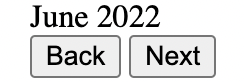

## Data Interactions

(Data interaction remains similiar to that stated in milestone-1.md. However, this is subjects to change)

Upon visiting Allendar, the user will be greeted with:
- A navigation and utitlies bar at the top.
- A mini calendar (top left) and tasks manager (bottom left) on the left
- A calendar panel at the center.

1. Task Creation

In the navigation and utilities bar, there will be a "+" icon. Clicking the icon will open a dropdown menu with a few options and one of them is the "create tasks". Selecting "create a task" will open panel with multiple text fields for the users to enter. These fields are details that comes with the task and have labels on top of the fields like notes, subtasks, priority ratings, etc. When the users are satisfied with the contents they entered, the task will be minimized as a block and appeared in a list panel (staging panel) on the left.

1. Calendar
 
The calendar panel is at the center of the website since it is the most important are the user need to focus on. The calendar panel comes in with different view mode:

- Kanban: **Column-oriented table** - each column comes with a heading (user inputted) and the rest of the columns are space for tasks for to be dragged on from the staging area or from another column. 

- Daily: Column-oriented table - each column comes with a heading that indicate the designated day and and the rest of the columns are space for tasks for to be dragged on from the staging area or from another column. On the left will be a ruler of time-stamps, thus the user can organized the tasks to their desired time-stamps. 

- Monthly: **Cell-oreientated table** - each cell is a designated day and the number of cells is equivalent to the number of days in the month. Tasks can be dragged on to each cell from the staging area or from another cell. 

- Yearly: Cell-oreientated table - each cell is a designated month and the number of cells is equivalent to the number of month in a year. Tasks can be dragged on to each cell from the staging area or from another cell. 

Each task is minimized to a block when dragged on the calendar and can be mamiximized for a detailed look if the task block is cliked. The maximized view of a task block is called the **block-panel**.

## Product Progress:

Video Demo: https://drive.google.com/file/d/18C7xvKtYqqhJsZeSpcWKZ2GPx2zrXeVo/view

Upon visiting Allendar, the user will be greeted with a calendar at the center of the website.

There are a few basic functionality the user can interact with the calendar. First is the month navigation button, where the user can press next is to view one month ahead of time or press back to view one month before. The range of month viewing does not have limits.

The second feature is a highlighter of the current day. The calendar automatically highlight the current day square to green based on the US calendar.

The third feature is a new event adder that allows the user to add an event based on the corresponding day. Upon clicking on a day square, a UI will appear on the right side of the calendar. A field will alow the user to add in the title of th event and he event will appear in the day block.

A feature that is complement to the previous is an event-deleter, which allows the user to delete the event from the corresponding day. Clicking on a day square will show the event-deleter UI along with the event title. Deleting the event will remove the event from the day square.

All events are saved in local storage and will not removed upon page refresh.d
